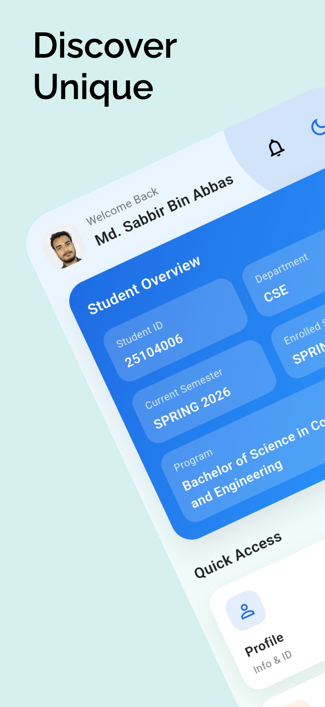
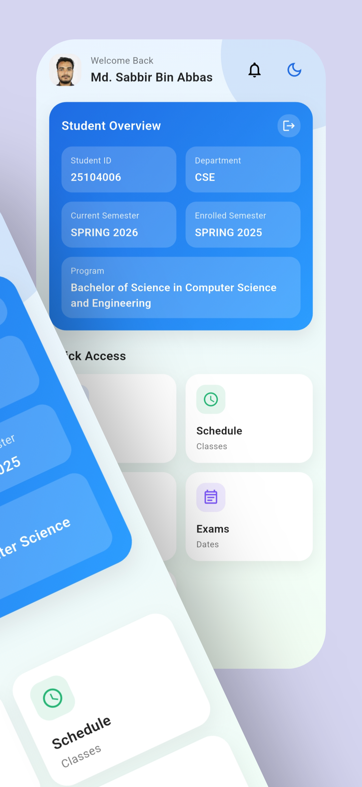
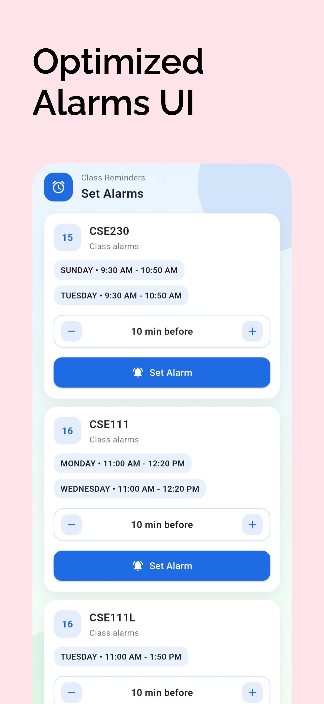
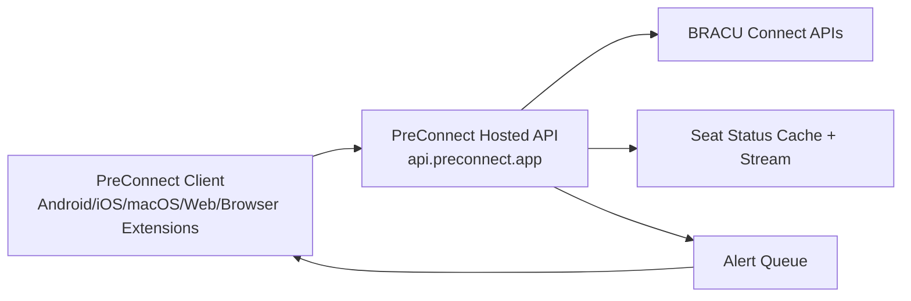

<div align="center">


# PreConnect

Fast, Calm Academic Companion App.
An initiative run by [BRAC University](https://bracu.ac.bd) students.

[](https://github.com/sabbirba/preconnect/releases/latest)
[](https://status.preconnect.app)
[](https://dart.dev)
[](https://flutter.dev)
[](LICENSE)
[](https://github.com/sabbirba/preconnect/blob/main/CONTRIBUTING.md)
[](https://github.com/sabbirba/preconnect/blob/main/CONTRIBUTING.md)
[](https://github.com/sabbirba/preconnect/commits/main)
[](https://github.com/sabbirba/preconnect/stargazers)
[](https://discord.gg/HwrgeFrvaz)

</div>

<div align="center">
<a href="https://apps.apple.com/app/id6791423431"></a>&nbsp;&nbsp;
<a href="https://play.google.com/store/apps/details?id=com.sabbirba.preconnect"></a>&nbsp;&nbsp;
<a href="https://chromewebstore.google.com/detail/preconnect/fcfkbdogaciifaihbfhnaijfhdcjokca"></a>&nbsp;&nbsp;
<a href="https://addons.mozilla.org/firefox/addon/preconnect/"></a>&nbsp;&nbsp;
<a href="https://web.preconnect.app"></a>&nbsp;&nbsp;
<a href="https://github.com/sabbirba/preconnect/releases/latest"></a>&nbsp;&nbsp;
<a href="https://preconnect.app/funding"></a>
</div>

## Table of Contents

- [Overview](#overview)
  - [Key Features](#key-features)
- [Installation](#installation)
- [Documentation](#documentation)
- [Screenshots](#screenshots)
- [Design System](#design-system)
- [Getting Started](#getting-started)
- [Community](#community)
- [Platform Support](#platform-support)
- [CI/CD](#cicd)
- [Architecture](#architecture)
- [Data Safety and Privacy](#data-safety-and-privacy-critical-dependencies)
- [Seat Status Proxy](#seat-status-proxy)
- [Roadmap](#roadmap)
- [FAQ](#faq)
- [Licenses & Trademarks](#licenses)

## Overview

A Flutter app for BRAC University students with SSO login and Connect API integration.

### Key Features

- **Academic & Schedule Management**: Class schedules, exam tracking, custom planner, CGPA calculator, and degree completion progress.
- **Real-time Course Registration & Seat Tracking**: Live seat status proxy, section details, exam maps, and prerequisite viewer.
- **Library & DSpace Companion**: LibSync study space availability & room reservation, plus DSpace academic repository browser.
- **Campus Utilities & Automation**: Automated Captive Wi-Fi login, campus wireless printing support, free computer lab status, and shuttle bus routes.
- **Social & Friend Sync**: QR-based friend schedule sharing & comparison.
- **Smart Notifications**: Push seat-status alerts via FCM, class alarms, and exam reminders.
- **Offline-First & Fast**: Cache-first architecture ensuring seamless offline access.

## Installation

Installation is available for multiple platforms through:

- Latest release assets (APK / AAB / Chrome extension / iOS / macOS): [GitHub Releases](https://github.com/sabbirba/preconnect/releases/latest)
- Web App: [web.preconnect.app](https://web.preconnect.app)
- iOS: [Apple App Store](https://apps.apple.com/app/id6791423431)
- Android: [Google Play Store](https://play.google.com/store/apps/details?id=com.sabbirba.preconnect)
- Chrome: [Chrome Web Store](https://chromewebstore.google.com/detail/preconnect/fcfkbdogaciifaihbfhnaijfhdcjokca)
- Firefox: [Firefox Add-ons](https://addons.mozilla.org/firefox/addon/preconnect/)
- macOS: [Apple App Store](https://apps.apple.com/app/id6791423431) or [Homebrew](https://github.com/hitblast/homebrew-tap):

  ```bash
  brew tap hitblast/tap
  brew trust hitblast/tap
  brew install preconnect
  ```

  Or, use the macOS package from [GitHub Releases](https://github.com/sabbirba/preconnect/releases/latest).

## Documentation

- Contributing: [CONTRIBUTING.md](CONTRIBUTING.md)
- Agent Guide: [AGENTS.md](AGENTS.md)
- Changelog: [CHANGELOG.md](CHANGELOG.md)
- Code of Conduct: [CODE_OF_CONDUCT.md](CODE_OF_CONDUCT.md)
- Security: [SECURITY.md](SECURITY.md)
- Trademark Guidelines: [TRADEMARKS.md](TRADEMARKS.md)
- Support / Funding: [FUNDING.md](FUNDING.md)

## Screenshots

<div>



</div>

## Design System

### Colors

- Primary: `#1E6BE3`
- Accent: `#22B573`
- Light background: `#EAF4FF` to `#F3FFF4`
- Dark background: `#000000`

### Typography

- Titles: 16–18 px, semibold
- Body: 11–14 px, regular

### Layout

- Card-first UI
- Padding: 14–16 px
- Radius: 18–22 px

## Getting Started

Want to build, test, or contribute locally? Follow the full setup guide in [CONTRIBUTING.md](CONTRIBUTING.md).

### Developer Quickstart (Recommended)

1. Clone and install packages:

```bash
git clone https://github.com/sabbirba/preconnect.git
cd preconnect
flutter pub get
cp .env.example .env
```

2. Run the app:

```bash
flutter run --dart-define-from-file=.env
```

3. Common checks:

```bash
flutter analyze
flutter test
```

## Community

New students and first-time contributors are welcome to ask questions in [Issues](https://github.com/sabbirba/preconnect/issues).
Please also review the community and safety guidance in [CODE_OF_CONDUCT.md](CODE_OF_CONDUCT.md) and the private reporting process in [SECURITY.md](SECURITY.md).

- [Report a bug](https://github.com/sabbirba/preconnect/issues/new?template=bug.yml)
- [Propose an idea](https://github.com/sabbirba/preconnect/issues/new?template=idea.yml)
- [Ask for contributor help](https://github.com/sabbirba/preconnect/issues/new?template=help.yml)
- [Report a vulnerability privately](https://github.com/sabbirba/preconnect/security/advisories/new)

## Platform Support

| Platform          | Status | Notes                                                                                 |
| ----------------- | ------ | ------------------------------------------------------------------------------------- |
| Android           | Stable | Signed APK/AAB are generated in release workflow when signing secrets are configured. |
| Chrome Extension  | Stable | Distributed through release assets and store promotion automation.                    |
| Firefox Extension | Stable | Built with the Chrome extension and published through store promotion automation.     |
| Web               | Beta   | Flutter web app built in CI and packaged as a release artifact.                       |
| iOS               | Beta   | CI builds are enabled, but signing/export depends on Apple certificates/profiles.     |
| macOS             | Beta   | CI builds and packages a DMG artifact from release workflow.                          |

### Contributor Systems

| System  | Contribution support                                                                                         |
| ------- | ------------------------------------------------------------------------------------------------------------ |
| macOS   | Dart, tests, Android, iOS, macOS, web, Chrome, and Firefox                                                   |
| Linux   | Dart, tests, Android, web, Chrome, Firefox, documentation, and shared application code                       |
| Windows | Dart, tests, Android, web, documentation, and shared application code; use WSL or Git Bash for shell scripts |

Linux and Windows desktop applications are not release targets, but Linux and Windows users can contribute normally.

## CI/CD

Release automation is handled by [`.github/workflows/release.yml`](.github/workflows/release.yml).

Main flow on push to `main`:

1. Auto-bumps `pubspec.yaml` build number (`x.y.z+NNN`)
2. Syncs `web/manifest.json` to the same `x.y.z` version
3. Creates/updates a GitHub release tag like `vX.Y.Z+NNN`
4. Builds and uploads platform artifacts (Android, iOS, macOS)
5. Builds and uploads Chrome and Firefox extension artifacts for deployment
6. Builds the Flutter web app and packages it as a release artifact
7. Publishes Android AAB to Google Play Internal and Beta testing tracks when required secrets are available

## Architecture

High-level request/data flow:



Why this architecture:

- Reduces direct upstream pressure on BRACU Connect APIs
- Centralizes seat-status caching and real-time triggers
- Supports push-based alerts for important seat changes
- Improves reliability and consistency across client platforms

## Data Safety and Privacy (Critical Dependencies)

Key packages related to user data safety/privacy are listed below.

| Package                  | What it does for privacy/safety                                                                                                        |
| ------------------------ | -------------------------------------------------------------------------------------------------------------------------------------- |
| `shared_preferences`     | Backing store for `AppStorage`, used for non-sensitive app settings, JSON blobs, and lightweight caches. Not used for secrets.         |
| `flutter_secure_storage` | Stores auth tokens and the captive Wi-Fi password in the platform keychain/secure storage. Persistence errors are surfaced explicitly. |
| `local_auth`             | Enables optional biometric/PIN app lock so only the device owner can open protected screens.                                           |
| `permission_handler`     | Ensures runtime permissions such as camera and notifications are requested explicitly and can be denied by the user.                   |
| `crypto`                 | Used for hashing in PKCE, cached image keys, and other local request helpers.                                                          |

Privacy notes:

- Auth tokens and the captive Wi-Fi password are stored only through `flutter_secure_storage` on native platforms.
- Logout removes all sensitive values, including the saved captive Wi-Fi password.
- Users can control OS-level permissions such as camera and notifications at any time.
- Local caches are used to improve offline and performance behavior.
- Push notifications are delivered via Firebase Cloud Messaging (FCM) — no polling required.

## Seat Status Proxy

The app does not call BRACU Connect seat-status endpoints directly. It uses the hosted proxy API:

- `GET /seat-status`
- `GET /details/:sectionId`
- `GET /staff/:initial`
- `GET /seat-status/ws` (real-time trigger)
- `GET /course-prerequisites`
- `POST /push/device/register`
- `POST /push/device/unregister`
- `PUT /push/seat-alerts`
- `PUT /push/seat-alerts/:sectionId`
- `DELETE /push/seat-alerts/:sectionId`

Current client flow:

- Load full section data from `/details/:sectionId`
- Listen to `/seat-status/ws` and refresh details on updates

Why this reduces Connect API calls:

- Server-side cache for seat, details, and staff data
- Shared upstream fetches across all users
- CDN/cache-friendly response headers
- No repeated per-device direct Connect seat-status polling
- Seat alerts are wired through the hosted seat-status server API and the push provider configured there.

## Documentation and Policies

- Status Page: [status.preconnect.app](https://status.preconnect.app)
- The full repo policy links are listed in the [Documentation](#documentation) section above.

## Support PreConnect

Community driven and free for every student.

Support the project via [preconnect.app/funding](https://preconnect.app/funding)

## Roadmap

- Improve offline reliability and sync conflict handling for schedule and profile views
- Expand notification controls (fine-grained seat alert preferences)
- Add more onboarding guidance for first-time BRACU students
- Increase automated coverage for API/service and schedule flows
- Harden release pipeline with richer health checks and release validation

## FAQ

### Is this an official BRAC University app?

No. PreConnect is a community-driven initiative run by BRAC University students.

### Does the app need production secrets to build locally?

No. Normal contributor builds can run with missing or blank optional env values. See [CONTRIBUTING.md](CONTRIBUTING.md) for the local setup flow. If you configure a local Firebase or Google Sign-in debug build, register the following SHA-1 developer fingerprint in the console:
`DE:59:46:D4:EF:D3:0B:76:E8:3B:10:B5:8A:B4:D0:CE:BA:EB:E4:B4`

### Does PreConnect store sensitive login data insecurely?

On native platforms, sensitive values are stored in platform secure storage, never in plain shared preferences. Browser-extension builds use extension storage because platform keychain APIs are unavailable there.

### Does the app work with poor internet?

Yes. Several flows use cache-first behavior so students can still access key information with limited connectivity.

### How do I use the browser version?

Use the Chrome or Firefox extension from the latest release assets. Contributor build instructions live in [CONTRIBUTING.md](CONTRIBUTING.md).

### Where do seat-status updates come from?

The app uses the hosted PreConnect API (`api.preconnect.app`) for cached seat-status data, stream updates, and alerts.

## Acknowledgements

- BRAC University student community for continuous feedback and testing
- Flutter and Dart ecosystems
- Open-source package maintainers on [pub.dev](https://pub.dev)
- Infrastructure providers: Cloudflare services and the configured push provider

## Developer Credit

- NaiveInvestigator — GitHub: [@NaiveInvestigator](https://github.com/NaiveInvestigator)
- Sabbir Bin Abbas — GitHub: [@sabbirba](https://github.com/sabbirba)

## Licenses

This project is licensed under GPL-3.0 (see [LICENSE](LICENSE)).

Third-party packages follow their own license (see package pages on [pub.dev](https://pub.dev)).

## Trademarks

Copyright (c) 2025-present PreConnect contributors. The PreConnect name and logo are trademarks of PreConnect contributors.

Please see our [trademark guidelines](https://github.com/sabbirba/preconnect/blob/main/TRADEMARKS.md) for info on acceptable usage.

## Contributors

<a href="https://github.com/sabbirba/preconnect/graphs/contributors">
  
</a>

## Star History

<a href="https://www.star-history.com/?repos=sabbirba%2Fpreconnect&type=timeline&logscale=&legend=top-left">
 <picture>
   <source media="(prefers-color-scheme: dark)" srcset="https://api.star-history.com/chart?repos=sabbirba/preconnect&type=timeline&theme=dark&logscale&legend=top-left&sealed_token=Ag1I2dIzxyH3nMh5IpWlMvpxC7LyuJivosi_OSce_Wcf6LFmYcgMuJFsIibo4AUlI3pgAmbXl_jKXqNJdrXllCa1NE74Wt5D0q85JIGbsP0zGt2x07WIkg" />
   <source media="(prefers-color-scheme: light)" srcset="https://api.star-history.com/chart?repos=sabbirba/preconnect&type=timeline&logscale&legend=top-left&sealed_token=Ag1I2dIzxyH3nMh5IpWlMvpxC7LyuJivosi_OSce_Wcf6LFmYcgMuJFsIibo4AUlI3pgAmbXl_jKXqNJdrXllCa1NE74Wt5D0q85JIGbsP0zGt2x07WIkg" />
   
 </picture>
</a>

## Repository Map

| Path             | Responsibility                                                                               |
| ---------------- | -------------------------------------------------------------------------------------------- |
| `.agents/skills` | Shared contribution workflows for coding agents                                              |
| `.github`        | Issue intake, review ownership, CI, releases, dependency updates, and store promotion        |
| `android`        | Android application, Gradle configuration, native channels, resources, and Fastlane          |
| `ios`            | iOS application, Xcode configuration, native channels, entitlements, and Fastlane            |
| `macos`          | macOS application, Xcode configuration, native integrations, entitlements, and Fastlane      |
| `assets`         | Flutter-bundled application assets                                                           |
| `lib/api`        | Remote services, repositories, caches, and API contracts                                     |
| `lib/features`   | Feature-owned application and data workflows                                                 |
| `lib/libsync`    | Library authentication, reservation, and availability features                               |
| `lib/model`      | Shared domain models and serialization                                                       |
| `lib/pages`      | Screens, feature sections, and shared presentation widgets                                   |
| `lib/tools`      | Storage, HTTP, authentication, platform bridges, and common utilities                        |
| `lib/widgets`    | Shared cross-feature widgets                                                                 |
| `test`           | Authentication, logout, refresh, storage, schedules, devices, and platform-channel tests     |
| `tool`           | Extension builds, version synchronization, and publishing utilities                          |
| `web`            | Web shell, extension entry points, background worker, manifests, and local runtime resources |
