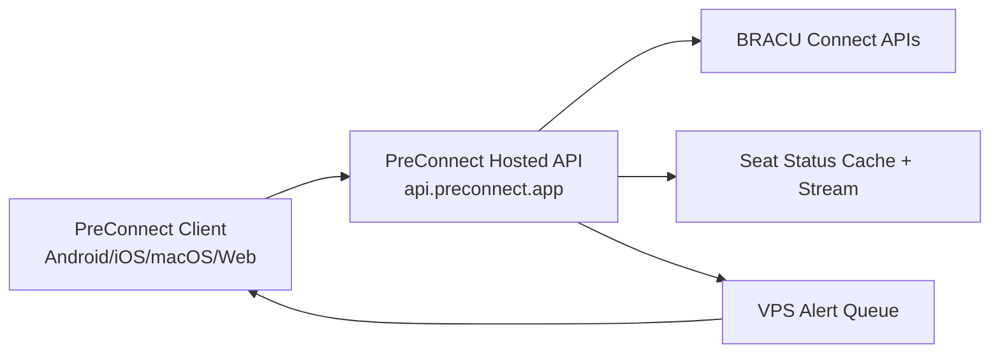

<div align="center">


# PreConnect

Fast, Calm Academic Companion App.
An initiative run by [BRAC University](https://bracu.ac.bd) students.

  

</div>

## Overview

A Flutter app for BRAC University students with SSO login and Connect API integration.

### Key features

- Simple, predictable navigation
- Class schedules and exam tracking
- Smart alarms and reminders
- QR-based friend sharing
- Offline-friendly, cache-first experience

## Screenshots
<div>


</div>

## Design System

### Colors

- Primary: `#1E6BE3`
- Accent: `#22B573`
- Light background: `#EAF4FF` to `#F3FFF4`
- Dark background: `#000000`

### Typography

- Titles: 16–18 px, semibold
- Body: 11–14 px, regular

### Layout

- Card-first UI
- Padding: 14–16 px
- Radius: 18–22 px

## Project Structure

```
lib/
  main.dart          Entry point
  app.dart           App shell & routing
  api/               Auth & API client
  model/             Data models
  pages/             UI screens & sections
  tools/             Utilities (caching, helpers, etc.)
android/             Android configuration (Kotlin)
ios/                 iOS configuration (Swift)
macos/               macOS shell
web/                 Web shell
assets/              Icons & SVGs
```

## Getting Started

### Requirements

- Flutter stable
- Android Studio with Android SDK
- Java 17

Check your setup:

```bash
flutter doctor -v
```

Install packages:

```bash
flutter pub get
```

### Environment setup

Copy the example env file:

```bash
cp .env.example .env
```

Update [`.env.example`](.env.example) values in your local [`.env`](.env):

- `storeFile`
- `storePassword`
- `keyAlias`
- `keyPassword`
- `DEVELOPMENT_TEAM`
- `REWARDED_AD_UNIT_ID`
- `BANNER_AD_UNIT_ID`
- `ADS_APP_ID_IOS`

### Android Signing Setup

Release builds require `android/key.properties`.

Create `android/key.properties` manually with:

```bash
cat > android/key.properties <<'EOF'
storeFile=preconnect-release-key.jks
storePassword=YOUR_STORE_PASSWORD
keyAlias=preconnect
keyPassword=YOUR_KEY_PASSWORD
EOF
```

Update the values to match your keystore. The Android release build will fail if `android/key.properties` is missing.

### Run the app

```bash
flutter run --dart-define-from-file=.env
```

```bash
cp .env.example .env
```

### Build Android APK

Release APK:

```bash
flutter build apk --release --dart-define-from-file=.env
```

Output:

```bash
build/app/outputs/flutter-apk/app-release.apk
```

### Build Android AAB

Release AAB:

```bash
flutter build appbundle --release --dart-define-from-file=.env
```

Output:

```bash
build/app/outputs/bundle/release/app-release.aab
```

## Download

- Latest release assets (APK / AAB / Web zip / iOS / macOS): [GitHub Releases](https://github.com/sabbirba/preconnect/releases/latest)
- Web app: [web.preconnect.app](https://web.preconnect.app)
- Release feed: [All releases](https://github.com/sabbirba/preconnect/releases)

## Platform Support

| Platform | Status | Notes |
| --- | --- | --- |
| Android | Stable | Signed APK/AAB are generated in release workflow when signing secrets are configured. |
| Web | Stable | Built by CI and deployed via containerized web service on VPS. |
| iOS | Beta | CI builds are enabled, but signing/export depends on Apple certificates/profiles. |
| macOS | Beta | CI builds and packages a DMG artifact from release workflow. |

## CI/CD

Release automation is handled by [`.github/workflows/release.yml`](.github/workflows/release.yml).

Main flow on push to `main`:

1. Auto-bumps `pubspec.yaml` build number (`x.y.z+NNN`)
2. Creates/updates a GitHub release tag like `v1.2.3+456`
3. Builds and uploads platform artifacts (Android, iOS, macOS, Web)
4. Uploads web release artifact for deployment
5. Publishes Android AAB to Google Play Internal and Beta testing tracks when required secrets are available

## Architecture

High-level request/data flow:



Why this architecture:

- Reduces direct upstream pressure on BRACU Connect APIs
- Centralizes seat-status caching and real-time triggers
- Supports push-based alerts for important seat changes
- Improves reliability and consistency across client platforms

## Data Safety and Privacy (Critical Dependencies)

Key packages related to user data safety/privacy are listed below.

| Package | What it does for privacy/safety |
| --- | --- |
| `flutter_secure_storage` | Stores sensitive auth/session tokens in encrypted device-backed secure storage (Keychain/Keystore), instead of plain local storage. |
| `shared_preferences` | Stores non-sensitive app settings and flags (for example onboarding and UI preferences). Not used for secret credentials. |
| `sembast` | Provides structured local database caching so app data can stay on-device and support offline usage with controlled reads/writes. |
| `local_auth` | Enables optional biometric/PIN app lock so only the device owner can open protected screens. |
| `push_notifications_service` | Polls the VPS backend for queued seat alerts using a local installation ID, without Firebase. |
| `permission_handler` | Ensures runtime permissions (camera/notifications) are requested explicitly and can be denied by the user. |
| `crypto` | Used for cryptographic hashing in integrity/security flows to strengthen request validation. |

Privacy notes:

- Sensitive tokens are kept in secure storage, not plain preferences.
- Users can control OS-level permissions (camera/notifications) at any time.
- Local caches are used to improve offline and performance behavior.
- Notification delivery depends on the VPS queue and client polling.

## Testing & Quality

Run these checks before opening a PR:

```bash
flutter pub get
flutter analyze
flutter test
dart format --set-exit-if-changed .
```

Optional local release smoke checks:

```bash
flutter build apk --release --dart-define-from-file=.env
flutter build web
```

## Seat Status Proxy

The app does not call BRACU Connect seat-status endpoints directly. It uses the hosted proxy API:

- `GET /seat-status`
- `GET /sections/:sectionId/details`
- `GET /staff/:initial`
- `GET /seat-status/stream` (real-time trigger)
- `GET /course-prerequisites`
- `POST /push/device/register`
- `POST /push/device/unregister`
- `PUT /push/seat-alerts`
- `PUT /push/seat-alerts/:sectionId`
- `DELETE /push/seat-alerts/:sectionId`

Current client flow:

- Load full section data from `/sections/details`
- Cache locally on device
- Listen to `/seat-status/stream` and refresh details on updates

Why this reduces Connect API calls:

- Server-side cache for seat, details, and staff data
- Shared upstream fetches across all users
- CDN/cache-friendly response headers
- No repeated per-device direct Connect seat-status polling
- Seat alerts are wired through the hosted seat-status server API and the push provider configured there.

## Documentation & Policies

- Code of Conduct: [CODE_OF_CONDUCT.md](CODE_OF_CONDUCT.md)
- Contributing: [CONTRIBUTING.md](CONTRIBUTING.md)
- Security: [SECURITY.md](SECURITY.md)
- Environment Example: [.env.example](.env.example)
- Workflows: [.github/workflows/release.yml](.github/workflows/release.yml)
- Hosted Seat Status API Server: [api.preconnect.app](https://api.preconnect.app)
- Web App: [web.preconnect.app](https://web.preconnect.app)
- Status Page: [status.preconnect.app](https://status.preconnect.app)

## Support PreConnect

Community driven and free for every student.

If you want to support the project locally, you can send to:

- bKash / Nagad / Upay: **01865493144**

Reference (required): **PreConnect App**

Bug reports, feature requests, and ideas are welcome. Please create issues in our GitHub repo.

## Roadmap

- Improve offline reliability and sync conflict handling for schedule and profile views
- Expand notification controls (fine-grained seat alert preferences)
- Add more onboarding guidance for first-time BRACU students
- Increase automated coverage for API/service and schedule flows
- Harden release pipeline with richer health checks and release validation

## FAQ

### Is this an official BRAC University app?

No, PreConnect is an initiative run by BRAC University students. It is community-driven and focused on improving daily academic workflows.

### Does PreConnect store sensitive login data insecurely?

Sensitive tokens are stored using `flutter_secure_storage` (on-device-backed secure storage), not plain local preferences and server data share.

### Does the app work with poor internet?

Yes. The app uses cache-first patterns in several flows so students can still access key information with limited connectivity.

### Where do seat-status updates come from?

The app uses a hosted proxy (`api.preconnect.app`) that handles caching and stream updates, then notifies clients when data changes.

## Acknowledgements

- BRAC University student community for continuous feedback and testing
- Flutter and Dart ecosystems
- Open-source package maintainers on [pub.dev](https://pub.dev)
- Infrastructure providers: VPS-hosted services and the configured push provider

## Developer Credit
- NaiveInvestigator — GitHub: [@NaiveInvestigator](https://github.com/NaiveInvestigator)
- Sabbir Bin Abbas — GitHub: [@sabbirba](https://github.com/sabbirba)

## Licenses
This project is licensed under GPL-3.0 (see [LICENSE](LICENSE)).

Third-party packages follow their own license (see package pages on [pub.dev](https://pub.dev)).

## Trademarks

Copyright (c) 2025-present PreConnect contributors. The PreConnect name and logo are trademarks of PreConnect contributors.

Please see our [trademark guidelines](https://github.com/sabbirba/preconnect/blob/main/TRADEMARKS.md) for info on acceptable usage.

## Contributors

<a href="https://github.com/sabbirba/preconnect/graphs/contributors">
  
</a>

## Star History

<a href="https://star-history.com/#sabbirba/preconnect">
  <picture>
    <source
      media="(prefers-color-scheme: dark)"
      srcset="https://api.star-history.com/svg?repos=sabbirba/preconnect&type=Date&theme=dark"
    />
    <source
      media="(prefers-color-scheme: light)"
      srcset="https://api.star-history.com/svg?repos=sabbirba/preconnect&type=Date"
    />
    
  </picture>
</a>
