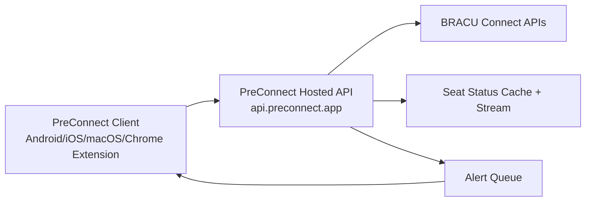

<div align="center">


# PreConnect

Fast, Calm Academic Companion App.
An initiative run by [BRAC University](https://bracu.ac.bd) students.

[](https://github.com/sabbirba/preconnect/releases/latest)

[](https://github.com/sabbirba/preconnect/blob/main/CONTRIBUTING.md)
[](https://github.com/sabbirba/preconnect/stargazers)
[](https://discord.gg/HwrgeFrvaz)

</div>

<div align="center">
<a href="https://play.google.com/store/apps/details?id=com.sabbirba.preconnect"></a>&nbsp;&nbsp;
<a href="https://chromewebstore.google.com/detail/preconnect/fcfkbdogaciifaihbfhnaijfhdcjokca"></a>&nbsp;&nbsp;
<a href="https://github.com/sabbirba/preconnect/releases/latest"></a>&nbsp;&nbsp;
<a href="https://preconnect.app/funding"></a>&nbsp;&nbsp;
<a href="https://status.preconnect.app/"></a>
</div>

## Overview

A Flutter app for BRAC University students with SSO login and Connect API integration.

### Key features

- Simple, predictable navigation
- Dashboard with today, schedule, and exam snapshots
- Class schedules and exam tracking
- Seat status, section details, and exam maps
- Smart alarms and reminders
- QR-based friend sharing
- Custom schedules and personal planning
- Campus tools like bus routes, free labs, printer support, and map/contact access
- Notifications, profile, degree progress, and student helpers
- Offline-friendly, cache-first experience

## Installation

Installation is available for multiple platforms through:

- Latest release assets (APK / AAB / Chrome extension / iOS / macOS): [GitHub Releases](https://github.com/sabbirba/preconnect/releases/latest)
- Android: [Google Play Store](https://play.google.com/store/apps/details?id=com.sabbirba.preconnect)
- macOS: Using [Homebrew](https://brew.sh):

  ```bash
  brew install hitblast/tap/preconnect
  ```
  Or, use GitHub Releases as mentioned before.

## Project Map

A detailed visual directory structure of the repository, including core files, models, APIs, and cross-platform configurations:

```bash
preconnect/
├── 📂 .github/workflows/          # CI/CD pipelines
│   ├── 📄 release.yml             # Handles auto-bumps, builds APK/AAB/Extension/Web
│   └── 📄 store-promotion.yml     # Weekly scheduled production deployment track
├── 📂 android/                    # Android native project configuration and Kotlin settings
├── 📂 ios/                        # iOS native project runner configs and Swift setups
├── 📂 macos/                      # macOS desktop application runner configs
├── 📂 web/                        # Chrome Extension & Web app build shell
│   ├── 📄 manifest.json           # Extension configuration (permissions, scripts, icons, keys)
│   └── 📄 background.dart.js      # Compiled service worker executing in the extension background
├── 📂 assets/                     # App-wide visual elements, vector SVGs, and launcher icons
└── 📂 lib/                        # Core Flutter codebase
    ├── 📄 main.dart               # App entry point (initializes storage, firebase, routing)
    ├── 📄 app.dart                # Top-level shell widget (hosts router, themes, status page observer)
    ├── 📄 firebase_options.dart   # Firebase app configurations (generated)
    │
    ├── 📂 api/                    # HTTP clients and remote server controllers
    │   ├── 📄 api_client.dart     # HTTP client wrapper (handles SSO tokens, headers, and errors)
    │   ├── 📄 api_config.dart     # Backend base URL and API endpoints mapping
    │   ├── 📄 auth.dart           # Connection SSO authorization logic and login status checker
    │   ├── 📄 calendar.dart       # Fetches university academic calendar milestones
    │   ├── 📄 cdn_warmup.dart     # Service to pre-ping and warm up CDNs on launch
    │   ├── 📄 custom_schedules.dart # Sync utility for custom/personal student routines
    │   ├── 📄 exam_map.dart       # API queries to fetch campus building/exam hall map URLs
    │   ├── 📄 fcm.dart            # Firebase Cloud Messaging device registration & token updates
    │   ├── 📄 friend_store.dart   # Dynamic peer schedule sync & storage manager
    │   ├── 📄 grade_sheet.dart    # Academic grades, credits, and CGPA retrieval connectors
    │   ├── 📄 notification.dart   # In-app notifications fetcher and target action parsing
    │   ├── 📄 preferences_store.dart # Remote configuration sync for user-specific choices
    │   ├── 📄 profile.dart        # Connect Profile, photos, and ID-based details retrieval
    │   ├── 📄 progress.dart       # Degree audit tracker backend helper
    │   ├── 📄 repository_cache.dart # Cache wrapper for database resources (offline-first behavior)
    │   ├── 📄 schedule.dart       # API handlers to pull academic routines and timings
    │   └── 📄 seat_status.dart    # WebSocket connector & HTTP client for real-time section seat tracking
    │
    ├── 📂 model/                  # Data serialization models and JSON converters
    │   ├── 📄 calendar_info.dart  # Calendar event entities and lists
    │   ├── 📄 custom_schedule.dart # Custom routines, class slots, and times parsing
    │   ├── 📄 friend_schedule.dart # Peer routine formats, QR compression structure
    │   ├── 📄 progress_info.dart  # Grades, GPA sheets, and course credentials representation
    │   └── 📄 section_info.dart   # Course sections details (seats, timings, faculty)
    │
    ├── 📂 tools/                  # Shared utilities, cache managers, and system bridges
    │   ├── 📂 http/               # HTTP client variants for mobile, web, and sandbox environments
    │   ├── 📄 app_paths.dart      # Resolves platform-specific file directories
    │   ├── 📄 app_storage.dart    # Persistent storage engine utilizing SharedPreferences
    │   ├── 📄 storage_keys.dart   # Unique constants representing keys in SharedPreferences
    │   ├── 📄 client_bridge.dart  # Native JS bridge execution helper (Chrome Extension API)
    │   ├── 📄 token_storage.dart  # Vault for storing SSO access keys securely (Keychain/KeyStore)
    │   ├── 📄 time_utils.dart     # Routine conflict detection, timings, and Ramadan offset helpers
    │   └── 📄 cached_image.dart   # Network image optimizer utilizing storage cache
    │
    ├── 📂 widgets/                # Shared global UI elements
    │   └── 📄 image_web.dart      # Platform-specific image asset handling for web extension
    │
    └── 📂 pages/                  # Application screens and main sub-modules
        ├── 📄 login.dart          # Connection SSO login screen (OAuth2 WebView / Auth Flow)
        ├── 📄 onboarding.dart     # Welcome onboarding slider and first-time setup UI
        ├── 📄 home.dart           # Hub container managing layout navigation tabs
        ├── 📄 home_tab.dart       # Tab state wrapper controls
        │
        ├── 📂 home_sections/      # UI components under the dashboard tab
        │   ├── 📄 dashboard_view.dart    # Daily class schedules, quick actions grid
        │   ├── 📄 student_overview.dart  # Academic status summaries card (GPA, credits)
        │   └── 📄 exam_countdown.dart    # Upcoming exam reminder cards
        │
        ├── 📄 class_schedule.dart # Student routine view, class details, classroom finder
        ├── 📄 exam_schedule.dart  # Dynamic midterm and final exam schedules viewer
        ├── 📄 seat_status.dart    # Section seats tracker with filters, real-time sync
        ├── 📄 alarms.dart         # Class and exam alarms scheduling dashboard
        ├── 📄 notifications.dart  # Feed list of system alerts, news, and seat-alert triggers
        │
        ├── 📂 shared_widgets/     # Reusable modals, filters, and cards
        │   ├── 📄 seat_status.dart       # Card for checking seats capacity metrics
        │   ├── 📄 ui_core.dart           # Standard wrappers, buttons, alerts, and texts
        │   └── 📄 grade_card.dart        # Cards representing GPA scores, letter grades
        │
        ├── 📂 friend_schedule_sections/  # Peer routines management and comparative tools
        │   ├── 📄 friend_detail.dart     # Synced details of individual peer schedules
        │   └── 📄 compare_schedules.dart  # Matrix comparing availability overlaps between friends
        │
        ├── 📂 custom_schedules_sections/ # Draft routines planner tools
        │
        ├── 📂 student_profile_sections/  # Full academic profile view tabs
        │   ├── 📄 academic_summary.dart  # Semester-wise transcript details
        │   ├── 📄 payment_list.dart      # Student invoice logs, tuition payments, and balances
        │   └── 📄 attendance_summary.dart # Course-wise recorded attendance analysis
        │
        ├── 📄 degree_progress.dart  # Graduation checklist, program outline audit
        ├── 📄 cgpa_calculator.dart  # Cumulative GPA simulator, goal trackers
        ├── 📄 calendar.dart         # University academic calendar event lists
        ├── 📂 bus/                  # Shuttle routes, departure lists, bus tracking pages
        ├── 📄 free_labs.dart        # Real-time computer lab slots status
        ├── 📄 wifi_printer.dart     # Local printing services connection guidelines
        ├── 📄 captive_wifi.dart     # Auto-configuration helper for campus captive portal Wi-Fi
        ├── 📄 share_schedule.dart   # QR compression and schedule exporting page
        ├── 📄 scan_schedule.dart    # QR camera scanner for peer schedules
        ├── 📄 custom_schedules.dart # Custom ROUTINE creator and editor dashboard
        ├── 📄 all_courses.dart      # Course catalogue and database searcher
        ├── 📄 requirement_courses.dart # Departmental course requirements details
        ├── 📄 api_test.dart         # Diagnostic tool for testing Connect APIs
        ├── 📄 devs.dart             # Developer team details and donor funding methods
        ├── 📄 ui_kit.dart           # Custom styling guidelines and component sandbox
        └── 📄 settings.dart         # App language, cache, theme, and notification configs
```

## Documentation

- Contributing: [CONTRIBUTING.md](CONTRIBUTING.md)
- Code of Conduct: [CODE_OF_CONDUCT.md](CODE_OF_CONDUCT.md)
- Security: [SECURITY.md](SECURITY.md)
- Trademark Guidelines: [TRADEMARKS.md](TRADEMARKS.md)
- Support / Funding: [FUNDING.md](FUNDING.md)

## Screenshots

<div>


</div>

## Design System

### Colors

- Primary: `#1E6BE3`
- Accent: `#22B573`
- Light background: `#EAF4FF` to `#F3FFF4`
- Dark background: `#000000`

### Typography

- Titles: 16–18 px, semibold
- Body: 11–14 px, regular

### Layout

- Card-first UI
- Padding: 14–16 px
- Radius: 18–22 px


## Getting Started

Want to build, test, or contribute locally? Follow the full setup guide in [CONTRIBUTING.md](CONTRIBUTING.md).

### Developer Quickstart (Recommended)

1. Clone and install packages:

```bash
git clone https://github.com/sabbirba/preconnect.git
cd preconnect
flutter pub get
```

2. Run the app:

```bash
flutter run --dart-define-from-file=.env
```

3. Common checks:

```bash
flutter analyze
flutter test
```

## Community

New students and first-time contributors are welcome to ask questions in [Issues](https://github.com/sabbirba/preconnect/issues).
Please also review the community and safety guidance in [CODE_OF_CONDUCT.md](CODE_OF_CONDUCT.md) and the private reporting process in [SECURITY.md](SECURITY.md).

## Platform Support

| Platform         | Status  | Notes                                                                                   |
| ---------------- | ------- | --------------------------------------------------------------------------------------- |
| Android          | Stable  | Signed APK/AAB are generated in release workflow when signing secrets are configured.   |
| Chrome Extension | Stable  | Distributed through release assets and store promotion automation.                      |
| Web              | Beta    | Flutter web app built in CI and packaged as a release artifact.                        |
| iOS              | Beta    | CI builds are enabled, but signing/export depends on Apple certificates/profiles.       |
| macOS            | Beta    | CI builds and packages a DMG artifact from release workflow.                            |

## CI/CD

Release automation is handled by [`.github/workflows/release.yml`](.github/workflows/release.yml).

Main flow on push to `main`:

1. Auto-bumps `pubspec.yaml` build number (`x.y.z+NNN`)
2. Syncs `web/manifest.json` to the same `x.y.z` version
3. Creates/updates a GitHub release tag like `vX.Y.Z+NNN`
4. Builds and uploads platform artifacts (Android, iOS, macOS)
5. Builds and uploads the Chrome extension artifact for deployment
6. Builds the Flutter web app and packages it as a release artifact
7. Publishes Android AAB to Google Play Internal and Beta testing tracks when required secrets are available

## Architecture

High-level request/data flow:



Why this architecture:

- Reduces direct upstream pressure on BRACU Connect APIs
- Centralizes seat-status caching and real-time triggers
- Supports push-based alerts for important seat changes
- Improves reliability and consistency across client platforms

## Data Safety and Privacy (Critical Dependencies)

Key packages related to user data safety/privacy are listed below.

| Package                    | What it does for privacy/safety                                                                                                     |
| -------------------------- | ----------------------------------------------------------------------------------------------------------------------------------- |
| `shared_preferences`       | Backing store for `AppStorage`, used for non-sensitive app settings, JSON blobs, and lightweight caches. Not used for secrets.     |
| `flutter_secure_storage`   | Stores sensitive tokens (session, auth) in the platform keychain/secure enclave. Falls back to `AppStorage` if unavailable.        |
| `local_auth`               | Enables optional biometric/PIN app lock so only the device owner can open protected screens.                                        |
| `permission_handler`       | Ensures runtime permissions such as camera and notifications are requested explicitly and can be denied by the user.                 |
| `crypto`                   | Used for hashing in PKCE, cached image keys, and other local request helpers.                                                        |

Privacy notes:

- Sensitive tokens are stored in the platform keychain via `flutter_secure_storage`, with a fallback to standard local storage.
- Users can control OS-level permissions such as camera and notifications at any time.
- Local caches are used to improve offline and performance behavior.
- Push notifications are delivered via Firebase Cloud Messaging (FCM) — no polling required.

## Seat Status Proxy

The app does not call BRACU Connect seat-status endpoints directly. It uses the hosted proxy API:

- `GET /seat-status`
- `GET /details/:sectionId`
- `GET /staff/:initial`
- `GET /seat-status/ws` (real-time trigger)
- `GET /course-prerequisites`
- `POST /push/device/register`
- `POST /push/device/unregister`
- `PUT /push/seat-alerts`
- `PUT /push/seat-alerts/:sectionId`
- `DELETE /push/seat-alerts/:sectionId`

Current client flow:

- Load full section data from `/details/:sectionId`
- Listen to `/seat-status/ws` and refresh details on updates

Why this reduces Connect API calls:

- Server-side cache for seat, details, and staff data
- Shared upstream fetches across all users
- CDN/cache-friendly response headers
- No repeated per-device direct Connect seat-status polling
- Seat alerts are wired through the hosted seat-status server API and the push provider configured there.

## Documentation & Policies

- Status Page: [status.preconnect.app](https://status.preconnect.app)
- The full repo policy links are listed in the [Documentation](#documentation) section above.

## Support PreConnect

Community driven and free for every student.

Support the project via [preconnect.app/funding](https://preconnect.app/funding)

## Roadmap

- Improve offline reliability and sync conflict handling for schedule and profile views
- Expand notification controls (fine-grained seat alert preferences)
- Add more onboarding guidance for first-time BRACU students
- Increase automated coverage for API/service and schedule flows
- Harden release pipeline with richer health checks and release validation

## FAQ

### Is this an official BRAC University app?

No. PreConnect is a community-driven initiative run by BRAC University students.

### Does the app need production secrets to build locally?

No. Normal contributor builds can run with missing or blank optional env values. See [CONTRIBUTING.md](CONTRIBUTING.md) for the local setup flow.

### Does PreConnect store sensitive login data insecurely?

Sensitive tokens are stored in local app storage and web extension storage, not in plain shared preferences.

### Does the app work with poor internet?

Yes. Several flows use cache-first behavior so students can still access key information with limited connectivity.

### How do I use the browser version?

Use the Chrome extension from the latest release assets. Contributor build instructions live in [CONTRIBUTING.md](CONTRIBUTING.md).

### Where do seat-status updates come from?

The app uses the hosted PreConnect API (`api.preconnect.app`) for cached seat-status data, stream updates, and alerts.

## Acknowledgements

- BRAC University student community for continuous feedback and testing
- Flutter and Dart ecosystems
- Open-source package maintainers on [pub.dev](https://pub.dev)
- Infrastructure providers: Cloudflare services and the configured push provider

## Developer Credit

- NaiveInvestigator — GitHub: [@NaiveInvestigator](https://github.com/NaiveInvestigator)
- Sabbir Bin Abbas — GitHub: [@sabbirba](https://github.com/sabbirba)

## Licenses

This project is licensed under GPL-3.0 (see [LICENSE](LICENSE)).

Third-party packages follow their own license (see package pages on [pub.dev](https://pub.dev)).

## Trademarks

Copyright (c) 2025-present PreConnect contributors. The PreConnect name and logo are trademarks of PreConnect contributors.

Please see our [trademark guidelines](https://github.com/sabbirba/preconnect/blob/main/TRADEMARKS.md) for info on acceptable usage.

## Contributors

<a href="https://github.com/sabbirba/preconnect/graphs/contributors">
  
</a>

## Star History

<a href="https://star-history.com/#sabbirba/preconnect">
  <picture>
    <source
      media="(prefers-color-scheme: dark)"
      srcset="https://api.star-history.com/svg?repos=sabbirba/preconnect&type=Date&theme=dark"
    />
    <source
      media="(prefers-color-scheme: light)"
      srcset="https://api.star-history.com/svg?repos=sabbirba/preconnect&type=Date"
    />
    
  </picture>
</a>
