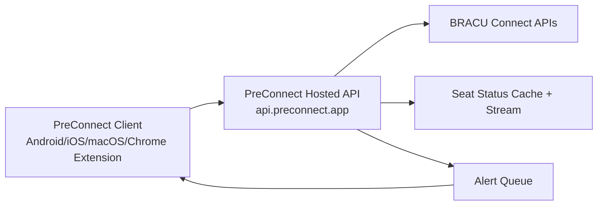

<div align="center">


# PreConnect

Fast, Calm Academic Companion App.
An initiative run by [BRAC University](https://bracu.ac.bd) students.

[](https://github.com/sabbirba/preconnect/releases/latest)

[](https://github.com/sabbirba/preconnect/blob/main/CONTRIBUTING.md)
[](https://github.com/sabbirba/preconnect/stargazers)
[](https://discord.gg/HwrgeFrvaz)

</div>

<div align="center">
<a href="https://play.google.com/store/apps/details?id=com.sabbirba.preconnect"></a>&nbsp;&nbsp;
<a href="https://github.com/sabbirba/preconnect/releases/download/v1.6.5%2B202605050/PreConnect-chrome-extension-release-1.6.5%2B202605050.zip"></a>&nbsp;&nbsp;
<a href="https://github.com/sabbirba/preconnect/releases/latest"></a>&nbsp;&nbsp;

</div>

## Overview

A Flutter app for BRAC University students with SSO login and Connect API integration.
The supported browser experience is the Chrome extension build.

### Key features

- Simple, predictable navigation
- Dashboard with today, schedule, and exam snapshots
- Class schedules and exam tracking
- Seat status, section details, and exam maps
- Smart alarms and reminders
- QR-based friend sharing
- Custom schedules and personal planning
- Campus tools like bus routes, free labs, printer support, and map/contact access
- Notifications, profile, degree progress, and student helpers
- Offline-friendly, cache-first experience

## Installation

Installation is available for multiple platforms through:

- Latest release assets (APK / AAB / Chrome extension / iOS / macOS): [GitHub Releases](https://github.com/sabbirba/preconnect/releases/latest)
- Android: [Google Play Store](https://play.google.com/store/apps/details?id=com.sabbirba.preconnect)
- macOS: Using [Homebrew](https://brew.sh):

  ```bash
  brew install hitblast/tap/preconnect
  ```
  Or, use GitHub Releases as mentioned before.

## Project Map

The repository is organized around the main product areas below:

- `lib/pages/home.dart` and `lib/pages/home_sections/` for the main dashboard and quick-access cards
- `lib/pages/class_schedule.dart` for class schedules
- `lib/pages/exam_schedule.dart` for midterm and final exam data
- `lib/pages/seat_status.dart` for seat availability and section details
- `lib/pages/alarms.dart` for class and exam reminders
- `lib/pages/notifications.dart` for app notifications
- `lib/pages/friend_schedule.dart` and `lib/pages/share_schedule.dart` for schedule sharing
- `lib/pages/custom_schedules.dart` for personal schedules
- `lib/pages/degree_progress.dart` and `lib/pages/cgpa_calculator.dart` for academic planning
- `lib/pages/bus.dart`, `lib/pages/free_labs.dart`, `lib/pages/wifi_printer.dart`, and `lib/pages/captive_wifi.dart` for campus utilities

## Documentation

- Contributing: [CONTRIBUTING.md](CONTRIBUTING.md)
- Code of Conduct: [CODE_OF_CONDUCT.md](CODE_OF_CONDUCT.md)
- Security: [SECURITY.md](SECURITY.md)
- Trademark Guidelines: [TRADEMARKS.md](TRADEMARKS.md)
- Support / Funding: [FUNDING.md](FUNDING.md)

## Screenshots

<div>


</div>

## Design System

### Colors

- Primary: `#1E6BE3`
- Accent: `#22B573`
- Light background: `#EAF4FF` to `#F3FFF4`
- Dark background: `#000000`

### Typography

- Titles: 16–18 px, semibold
- Body: 11–14 px, regular

### Layout

- Card-first UI
- Padding: 14–16 px
- Radius: 18–22 px

## Project Structure

```
lib/
  main.dart          Entry point
  app.dart           App shell & routing
  api/               Auth & API client
  model/             Data models
  pages/             UI screens & sections
  tools/             Utilities (caching, helpers, etc.)
android/             Android configuration (Kotlin)
ios/                 iOS configuration (Swift)
macos/               macOS shell
web/                 Chrome extension shell
assets/              Icons & SVGs
```

## Getting Started

Want to build, test, or contribute locally? Follow the full setup guide in [CONTRIBUTING.md](CONTRIBUTING.md).

## Community

New students and first-time contributors are welcome to ask questions in [GitHub issues](https://github.com/sabbirba/preconnect/issues).
Please also review the community and safety guidance in [CODE_OF_CONDUCT.md](CODE_OF_CONDUCT.md) and the private reporting process in [SECURITY.md](SECURITY.md).

## Platform Support

| Platform         | Status       | Notes                                                                                   |
| ---------------- | ------------ | --------------------------------------------------------------------------------------- |
| Android          | Stable       | Signed APK/AAB are generated in release workflow when signing secrets are configured.   |
| Chrome Extension | Stable       | Distributed through release assets and store promotion automation.                      |
| Web              | Not targeted | Use the Chrome extension build instead of a hosted Flutter web app.                     |
| iOS              | Beta         | CI builds are enabled, but signing/export depends on Apple certificates/profiles.       |
| macOS            | Beta         | CI builds and packages a DMG artifact from release workflow.                            |

## CI/CD

Release automation is handled by [`.github/workflows/release.yml`](.github/workflows/release.yml).

Main flow on push to `main`:

1. Auto-bumps `pubspec.yaml` build number (`x.y.z+NNN`)
2. Syncs `web/manifest.json` to the same `x.y.z` version
3. Creates/updates a GitHub release tag like `vX.Y.Z+NNN`
4. Builds and uploads platform artifacts (Android, iOS, macOS)
5. Builds and uploads the Chrome extension artifact for deployment
6. Publishes Android AAB to Google Play Internal and Beta testing tracks when required secrets are available

## Architecture

High-level request/data flow:



Why this architecture:

- Reduces direct upstream pressure on BRACU Connect APIs
- Centralizes seat-status caching and real-time triggers
- Supports push-based alerts for important seat changes
- Improves reliability and consistency across client platforms

## Data Safety and Privacy (Critical Dependencies)

Key packages related to user data safety/privacy are listed below.

| Package                  | What it does for privacy/safety                                                                                                     |
| ------------------------ | ----------------------------------------------------------------------------------------------------------------------------------- |
| `shared_preferences`     | Backing store for `AppStorage`, used for non-sensitive app settings, JSON blobs, and lightweight caches. Not used for secrets.     |
| `local_auth`             | Enables optional biometric/PIN app lock so only the device owner can open protected screens.                                        |
| `permission_handler`     | Ensures runtime permissions such as camera and notifications are requested explicitly and can be denied by the user.                 |
| `crypto`                 | Used for hashing in PKCE, cached image keys, and other local request helpers.                                                        |

Privacy notes:

- Sensitive tokens are kept in local app storage, not plain preferences.
- Users can control OS-level permissions such as camera and notifications at any time.
- Local caches are used to improve offline and performance behavior.
- Notification delivery depends on the VPS queue and client polling.

## Seat Status Proxy

The app does not call BRACU Connect seat-status endpoints directly. It uses the hosted proxy API:

- `GET /seat-status`
- `GET /sections/:sectionId/details`
- `GET /staff/:initial`
- `GET /seat-status/stream` (real-time trigger)
- `GET /course-prerequisites`
- `POST /push/device/register`
- `POST /push/device/unregister`
- `PUT /push/seat-alerts`
- `PUT /push/seat-alerts/:sectionId`
- `DELETE /push/seat-alerts/:sectionId`

Current client flow:

- Load full section data from `/sections/:sectionId/details`
- Listen to `/seat-status/stream` and refresh details on updates

Why this reduces Connect API calls:

- Server-side cache for seat, details, and staff data
- Shared upstream fetches across all users
- CDN/cache-friendly response headers
- No repeated per-device direct Connect seat-status polling
- Seat alerts are wired through the hosted seat-status server API and the push provider configured there.

## Documentation & Policies

- Status Page: [status.preconnect.app](https://status.preconnect.app)
- The full repo policy links are listed in the [Documentation](#documentation) section above.

## Support PreConnect

Community driven and free for every student.

If you want to support the project locally, you can send to:

- bKash / Nagad / Upay: **01865493144**

Reference (required): **PreConnect App**

More details: [FUNDING.md](FUNDING.md)

## Roadmap

- Improve offline reliability and sync conflict handling for schedule and profile views
- Expand notification controls (fine-grained seat alert preferences)
- Add more onboarding guidance for first-time BRACU students
- Increase automated coverage for API/service and schedule flows
- Harden release pipeline with richer health checks and release validation

## FAQ

### Is this an official BRAC University app?

No. PreConnect is a community-driven initiative run by BRAC University students.

### Does the app need production secrets to build locally?

No. Normal contributor builds can run with missing or blank optional env values. See [CONTRIBUTING.md](CONTRIBUTING.md) for the local setup flow.

### Does PreConnect store sensitive login data insecurely?

Sensitive tokens are stored in local app storage and web extension storage, not in plain shared preferences.

### Does the app work with poor internet?

Yes. Several flows use cache-first behavior so students can still access key information with limited connectivity.

### How do I use the browser version?

Use the Chrome extension from the latest release assets. Contributor build instructions live in [CONTRIBUTING.md](CONTRIBUTING.md).

### Where do seat-status updates come from?

The app uses the hosted PreConnect API (`api.preconnect.app`) for cached seat-status data, stream updates, and alerts.

### What if ads do not load locally?

Ad env values are optional. Leave them blank unless you are specifically working on ad behavior.

## Acknowledgements

- BRAC University student community for continuous feedback and testing
- Flutter and Dart ecosystems
- Open-source package maintainers on [pub.dev](https://pub.dev)
- Infrastructure providers: VPS-hosted services and the configured push provider

## Developer Credit

- NaiveInvestigator — GitHub: [@NaiveInvestigator](https://github.com/NaiveInvestigator)
- Sabbir Bin Abbas — GitHub: [@sabbirba](https://github.com/sabbirba)

## Licenses

This project is licensed under GPL-3.0 (see [LICENSE](LICENSE)).

Third-party packages follow their own license (see package pages on [pub.dev](https://pub.dev)).

## Trademarks

Copyright (c) 2025-present PreConnect contributors. The PreConnect name and logo are trademarks of PreConnect contributors.

Please see our [trademark guidelines](https://github.com/sabbirba/preconnect/blob/main/TRADEMARKS.md) for info on acceptable usage.

## Contributors

<a href="https://github.com/sabbirba/preconnect/graphs/contributors">
  
</a>

## Star History

<a href="https://star-history.com/#sabbirba/preconnect">
  <picture>
    <source
      media="(prefers-color-scheme: dark)"
      srcset="https://api.star-history.com/svg?repos=sabbirba/preconnect&type=Date&theme=dark"
    />
    <source
      media="(prefers-color-scheme: light)"
      srcset="https://api.star-history.com/svg?repos=sabbirba/preconnect&type=Date"
    />
    
  </picture>
</a>
